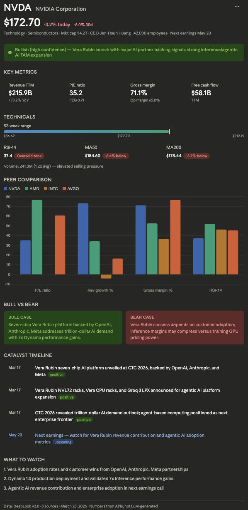

# DeepLook

Open-source MCP server for company research. 10 sources, structured output, under 15 seconds.

LLMs hallucinate financial data. DeepLook gives them real data instead — prices, financials, peers, news, technicals — from APIs, not from training data.

[](https://python.org)
[](LICENSE)
[](https://modelcontextprotocol.io)

---

## Quick start

**Hosted (30 seconds):**

```
Claude.ai → Settings → Connectors → Add MCP Server
URL: https://mcp.deeplook.dev/mcp
```

Then: *"Use DeepLook to research NVIDIA"*

Works with Claude, Cursor, Windsurf, or any MCP client.

**Self-host:**

```bash
git clone https://github.com/OSOJDJD/deeplook.git
cd deeplook
python3 -m venv venv && source venv/bin/activate
pip install -e .
cp .env.example .env   # add at least one LLM key
python -m deeplook.mcp_server --http --port 8819
```

Claude Desktop config (`~/Library/Application Support/Claude/claude_desktop_config.json`):

```json
{
  "mcpServers": {
    "deeplook": {
      "command": "/full/path/to/deeplook/venv/bin/python",
      "args": ["-m", "deeplook.mcp_server"],
      "cwd": "/full/path/to/deeplook",
      "env": { "ANTHROPIC_API_KEY": "sk-ant-..." }
    }
  }
}
```

> Replace `ANTHROPIC_API_KEY` with your preferred provider key: `OPENAI_API_KEY`, `GEMINI_API_KEY`, or `DEEPSEEK_API_KEY`.

CLI (no MCP):

```bash
python -m deeplook "NVIDIA"
python -m deeplook "Solana"
python -m deeplook "Anthropic"
```

---

## Example output



---

## Tools

| Tool | What it does | Speed |
|---|---|---|
| `deeplook_research` | Full report — financials, peers, news, technicals, catalysts | ~15s |
| `deeplook_lookup` | Quick snapshot — price, key metrics, headline | ~3s |

## Supported entities

Works for public equities, crypto tokens, DeFi protocols, private companies, VC firms, exchanges, and foundations.

---

## How it works

```
Company name
    ↓
Entity router → stock / crypto / private / VC / exchange / foundation / defunct
    ↓
10 parallel fetchers → yfinance, news, CoinGecko, SEC EDGAR, Wikipedia, ...
    ↓
Code layer extracts all numbers from APIs (not LLM-generated)
    ↓
LLM compress + judge → verdict, signals, catalysts
    ↓
Structured report (markdown + embedded JSON)
```

---

## Data sources

yfinance · DuckDuckGo News · Wikipedia · YouTube · CoinGecko · RootData · DeFiLlama · SEC EDGAR · Finnhub · Company websites

## API keys

At least one LLM provider required for self-host:

`ANTHROPIC_API_KEY` · `OPENAI_API_KEY` · `GEMINI_API_KEY` · `DEEPSEEK_API_KEY`

Optional: `TAVILY_API_KEY` · `COINGECKO_API_KEY` · `ROOTDATA_SKILL_KEY`

See `.env.example` for details.

## Eval

58 companies tested (mega-cap, growth, crypto, pre-IPO, international):

Overall 3.78/5.0 · Risk detection 4.36/5.0 · Signal quality 3.94/5.0

Framework in `/eval`. Run it yourself, contribute ground truth.

---

## Contributing

Found a bug? Report looks wrong? Have an idea? We'd love your help. See [CONTRIBUTING.md](CONTRIBUTING.md) to get started.

## License

MIT

---

Built by [OSOJDJD](https://github.com/OSOJDJD)
