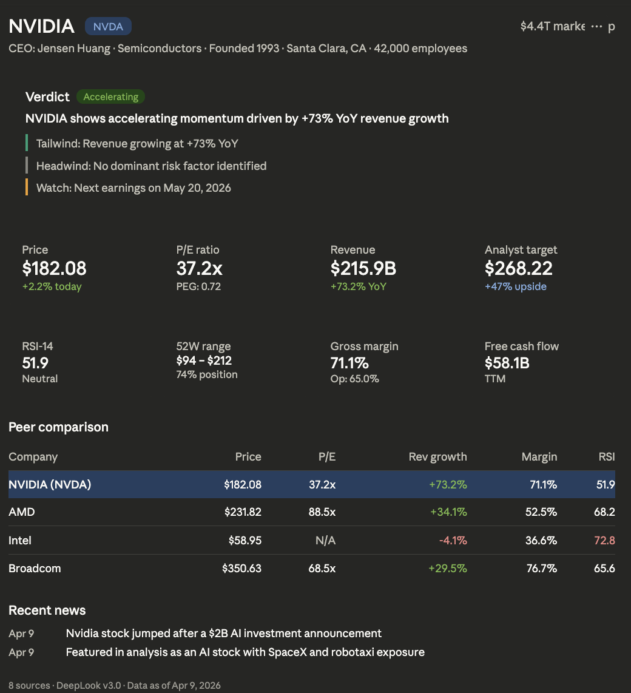
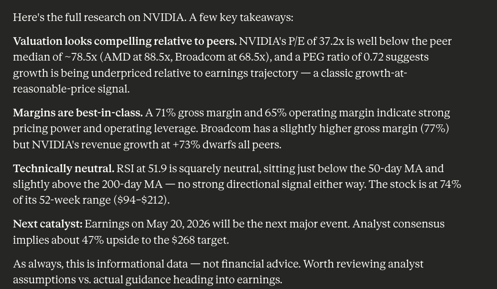

# DeepLook

LLMs hallucinate financial data. DeepLook gives them real numbers instead.

[](https://www.gnu.org/licenses/agpl-3.0)
[](https://github.com/OSOJDJD/deeplook)

## What happens when you ask "Research NVIDIA"





DeepLook provides structured context — real-time data from 8 APIs combined with analytical instructions that makes better output. The result:

- **Accurate, up-to-date information** — not hallucinated numbers
- **Clear at a glance** — financials, peers, technicals, news in one view
- **Better AI output** — because good context drives good analysis

Works for financial research, business due diligence, or any use case where you need to understand a company fast.

---

## Get started

### Claude.ai

1. Go to **Settings → Connectors → Add MCP**
2. Paste: `https://mcp.deeplook.dev/mcp`
3. Start a new chat and ask: *"Research NVIDIA"*

### Other MCP clients (Cursor, VS Code, Windsurf, Claude Desktop)

```json
{
  "mcpServers": {
    "deeplook": {
      "url": "https://mcp.deeplook.dev/mcp"
    }
  }
}
```

### Claude Code

```bash
claude mcp add --transport http deeplook https://mcp.deeplook.dev/mcp
```

### Self-host

```bash
git clone https://github.com/OSOJDJD/deeplook.git
cd deeplook
pip install -r requirements.txt
python -m deeplook.mcp_server
```

---

## What it covers

| Type | Examples |
|------|----------|
| Public stocks | NVIDIA, Apple, Tesla, TSMC |
| Crypto | Bitcoin, Solana, Ethereum |
| Private companies | Anthropic, Stripe, OpenAI |
| VC firms | a16z, Sequoia |
| Defunct | FTX, WeWork |

---

## Extend DeepLook

DeepLook covers the basics. If you need data it doesn't have yet — a new market, a new data source, a new analysis rule — you can add it. See [CONTRIBUTING.md](CONTRIBUTING.md).

---

## Roadmap

- [ ] More query tools — news, peers, financials, calendar as standalone lookups
- [ ] Broader client support — Cursor, ChatGPT, VS Code, Windsurf, Claude Code
- [ ] Deeper context — more analytical conditions, entity-specific instructions
- [ ] Community contributions — new data sources, custom analysis rules

---

## License

[AGPL-3.0](LICENSE)

---

Built by [@OSOJDJD](https://github.com/OSOJDJD)
